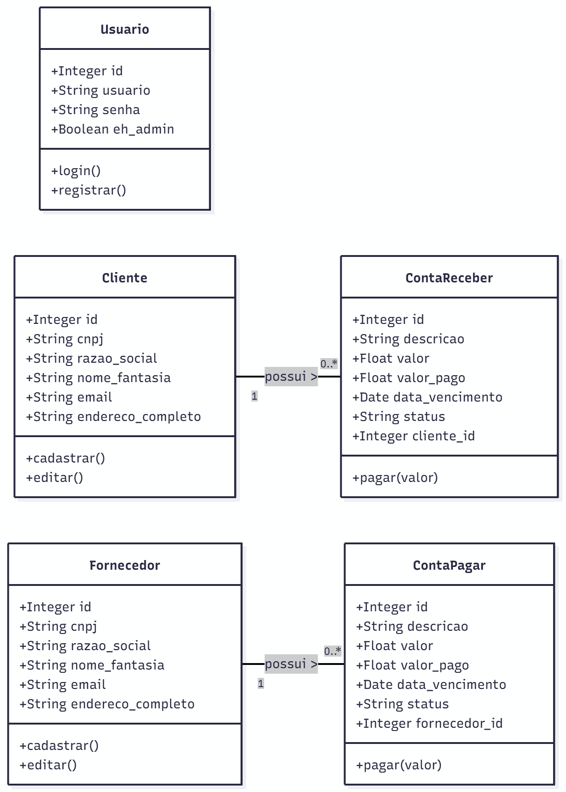
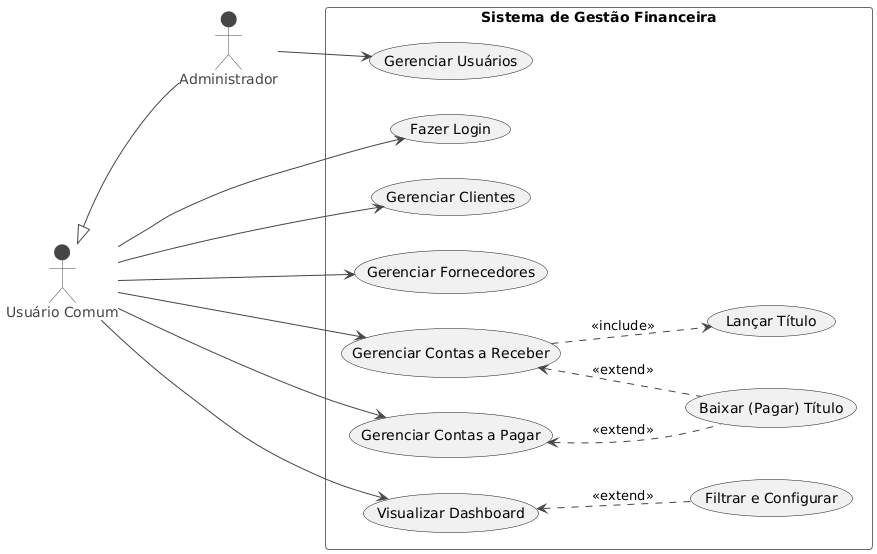

# Projeto AC ### Sistema de Gestão Financeira (FASTAPI + MySQL) Dockerizado 

Projeto da Faculdade Utilizando as seguintes Tecnologias:

- FASTAPI no Backend

- MySQL no Banco de dados
- HTML, JS, CSS puro no Frontend

# Funcionalidades 

- Login com usuário admin (senha admin123)
- Cadastro de usuários apenas com usuário admin (menu usuários não aparece para usuários criados)
- Cadastro e edição de Clientes/Fornecedores
- Cadastro e edição de Usuarios
- Lançamento de Contas a Pagar/Contas a Receber
- Modulo de Dashboards com B.I. para geração de gráficos

# Diagramas

# Como Rodar o Projeto 

- Unica dependência do projeto é o ambiente Docker Configurado para rodar o projeto em container

- Clonar o repositório com git clone

- Rodar o comando docker build com uma tag na raiz do projeto:

docker build -t cliente-app .

- Após o Build rodar o docker expõndo a porta

docker run -p 8000:8000 cliente-app 

- Acessar pelo browser no link:

http://localhost:8000

- Utilizar usuário de admin para logar:
Usuário: admin
Senha: admin123

